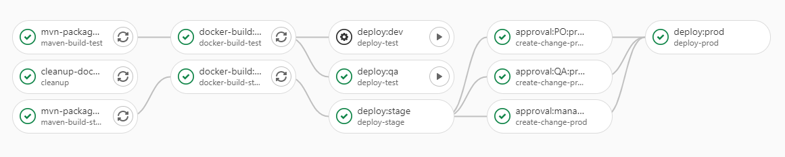
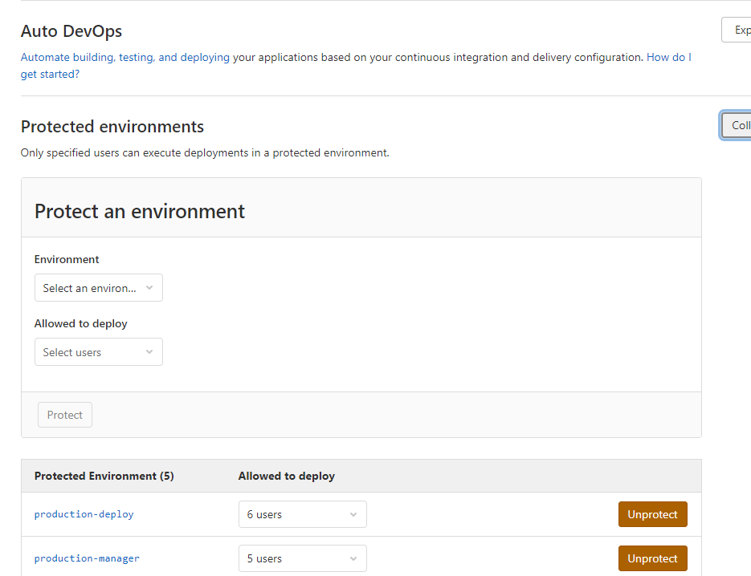
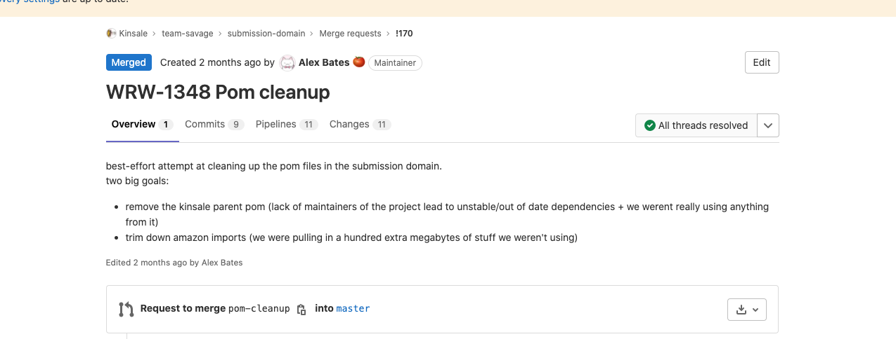

+++
title = "Example GitLab CI/CD Design"
date = "2022-06-15T14:09:32-04:00"
#cover = "cover.jpg"
tags = ["tech", "gitlab", "kinsale", "ci_cd"]
showFullContent = false
readingTime = true
hideComments = false
description = "An old implementation that I really enjoyed."
+++

# CI/CD Flow Doc for my Old Team

### Sections:
- [Summary](#summary)
- [Component Info](#component-info)
- [CI Files Sections](#gitlab-ci-file-sections)
- [Troubleshooting](#troubleshooting)

### Summary

This was written for the benefit of others, It pretty much boils down to "know GitLab CICD well, and know the integration points around it".
It't no longer immediately relevant to the work I'm doing, but it's decent enough to not outright delete.

***TL;DR of literally this entire page*** - 
_read and understand a project's gitlab-ci.yml file, google everything, 
then bug the operations team if you run into something that you literally don't have access to poke around with._

...

All projects that the Underwriting Team currently maintains follow very similar steps for the build and deploy of the 
project files. Specifics may change to meet the needs of the project, but the general shape of the process and steps 
can be applied to any up to date _(meaning, in AWS)_ project owned by the team. 

This document aims to provide general information about the team's CICD workflow, 
as well as list some common troubleshooting items that may be encountered.

**Note:** I consider CICD to be a moving target, and so should you. 
The reality of the process will drift with time, and this document should be updated as needed.  
*(or rewritten by someone else)*

### Component Info

These are the major items I would consider to "make up" our build and deploy process.   
Each piece can be considered complex in its own right, and has confused me deeply at some point. So have fun! 

#### Project-Level Items
- pom.xml / package.json - Project definition, artifact build processes, settings, blah blah. You should know what's in here. 
- Gitlab CI File - Defines execution, "meta" operations, and connection points between all other pieces of the CI process. 
- Cloudformation File - Defines infrastructure needed by the final application runtime, when deployed to an environment. 

#### System/Environment Items
- Gitlab Project Settings - Access control and information about pipelines/deployments/environments. Project-level permissions and access.
- AWS Console Tooling - Monitoring and status of deployed applications and infrastructure. (Secondary to the Cloudformation file in the project)
- GitLab Runners - Heavy interplay with the GitLab CI file, handles the literal execution of the defined CI jobs (artifact build/script execution).

### Gitlab CI File Sections
GitLab itself maintains excellent documentation about their CICD configuration, I **highly** recommend referring to it 
whenever clarification about existing or proposed changes come up. It's never steered me wrong. [**Documentation Here.**](https://docs.gitlab.com/ee/ci/README.html)

- **Stages** -        These are the main category of organization inside of a CICD file. 
                      The basic description is: all stages execute in a specific order, but all contents within a particular stage can execute simultaneously. 
                      So, for a 'build' stage, you could build several versions or components at the same time, the important part would be that they are all 
                      finished by the time the next stage is invoked. Or rather, the next stage will not be invoked until all subtasks are completed.
- **Jobs** -          These are the subtasks that were mentioned in the description of stages. A job must be assigned a parent stage, and all jobs within a stage must complete (in any order)
                      before moving on to the next stage. Jobs could be called the 'doing the thing' piece of the work definition, where as stages are more purely organizational.
- **Variables** -     Variables are fed into the runtime of the GitLab Runner / Docker container. There are a number of variables that are provided by the runner itself for things
                      like branch name or commit hash (refer to documentation above). We inject variables declared in the CI file as well, primarily for pass through information to AWS, or 
                      for customized input into commands.   
                      Variables declared at the top level of the CI file are accessible by ALL jobs.
- **Env_Variables** - These do not actually exist, but the convention is so common in our projects it is worth calling out. Lists of variables prefixed by environment are fed 
                      directly by reference into a particular job (dev/qa variables fed into lower environment build jobs, etc.).
                      So basically instead of defining the necesary variables inside the job and duplicating them, they are passed by reference as a one-liner in the job itself. 
                      (references used in this way is a YAML standard, not a GitLab thing)
- **Scripts** -       Another common section in our CI files that don't necessarily mean anything just by the name, 
                      these are fed by reference to wherever they are needed, in various jobs defined in the CI file.
                      This is an alternative to defining them inside of each job and duplicating / complicating them. 

### Troubleshooting
***READ THE LOGS OF THE THING THAT ISN'T WORKING.***

#### Timeouts
There are two places in the build process where timeouts can originate.   

**The GitLab Runner:**   
The runner itself can timeout during any stage of the process (since it coordinates everything). By default a job will attempt to complete for ~1 hour, before the runner 
forces it to terminate and transitions to an error state.
It is almost never the runner's fault that the timeout occurred, usually you will need to look into which job in the pipeline failed and why. 
Logs are your friend here. 
If it does seem like the runner itself is the issue, retry once and then reach out to the Ops team for further troubleshooting.

**CloudFormation:**  
In my experience, timeouts on the CloudFormation side are caused by two things mainly. Errors in the CFT file itself, or missing critical infrastructure in the stack, due to trying to 
deploy an application during scheduled downtime in the lower environments.
Stack updates will fail somewhere in the 1-2 hour range, and can be investigated further via the AWS Console. 
Again the most common solution is to simply investigate the logs and rollback/retry the stack update operation via the AWS console. 

**Note:** A failed stack update in AWS ***Must*** be cleaned up in AWS before retrying the pipeline in GitLab. 
Cloudformation will automatically fail all automated operations until the stack is manually rolled back to a previous correct state.  
PLEASE avoid deleting the stack if you can help it. There is a risk of unforseen effects (Cognito/Azure settings).

#### Inaccessable Pipeline Operations
Manual actions that can be taken with a pipeline in GitLab are controlled by project-level roles that are assigned either at the group level or the project level.
By default the settings are generally that the dev role can push to non-protected branches and run pipelines, maintainers can merge/modify protected branches along with 
all the dev capabilities, and reporters can only view the project code without making any changes or taking action. 

For the sake of managing releases, we use an additional layer on configurable control in the form of environments. Basically, you can overwrite the default behavior of 
roles assigned in the project, and manually define who can take actions for a particular stage in the CICD pipeline. 

All this to say, if a user cannot take actions that they should be able to in the project, make sure they have the proper role, and if they are a manager-type, 
ensure they are added to the list of users that can interface with the appropriate environment (in the project CICD settings, only accessible by maintainers/owner of the project).

#### Missing Info in Jira {.jira-section}
Jira integration with GitLab is handled via names of commits, branches, and merge requests inside of the project. 
If you include the story number from jira at the beginning of any of these, Jira will automatically display relevant information inside of the story itself. 

Convention varies slightly between teams, but the Underwriting team is expected to AT LEAST include the story number in the MR for the work. 

#### Docker Errors
If you see errors talking about DockerHub or authorization around Docker, literally just go straight to Ops. 
Docker errors inside of the GitLab Runners is the exclusive territory of the Ops team, devs don't have access.
