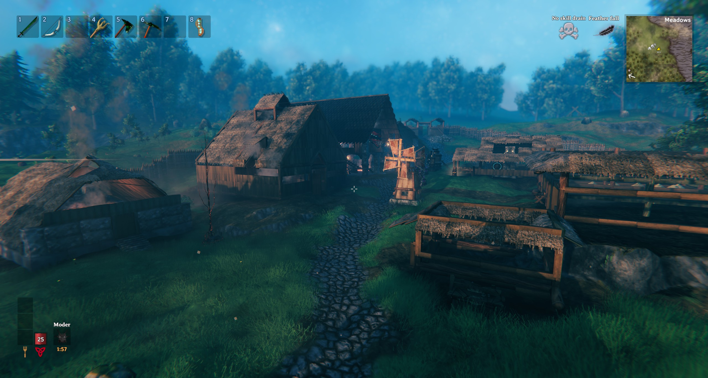
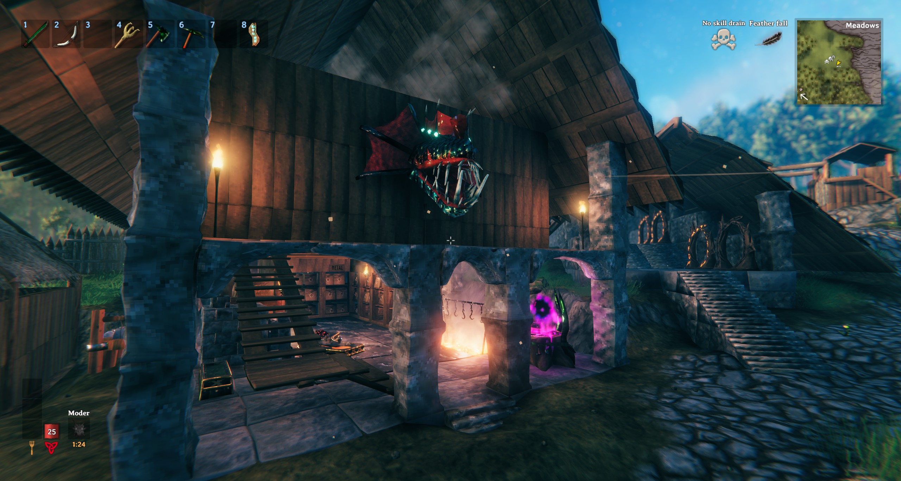
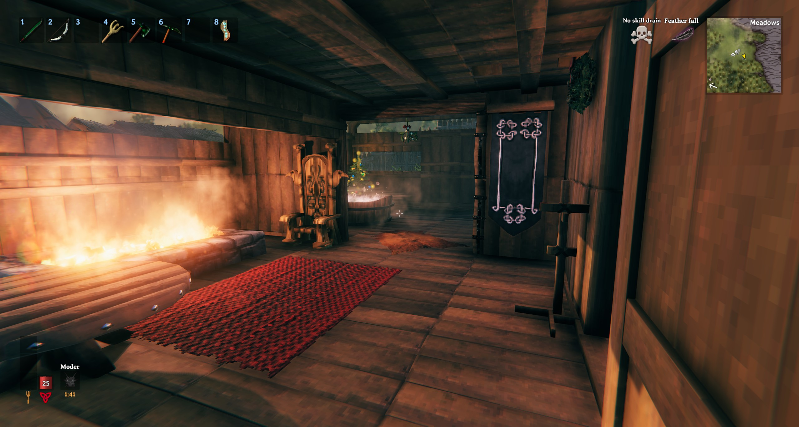

## Intro 




Valheim put out new content somewhat recently. 
Woo! 
I consider the game to be something that is very much intended to be played with a few extra people in tow.
Fortunately some friends were down for it. 
Woo again!

Something about the game that isn't necessarily unique but is perhaps less common to encounter 
is the large amount of down-time between what I would consider "eventful" moments. 
There is a lot of wandering around in order to find things you need, and a lot of preparation required before 
fighting bosses or going to new biomes. 
Because of this, I thought it would be more enjoyable to have the game server running all the time and allow 
people to log in at their leisure to work on background tasks.

I would say that this is a great way to play the game. 
It's difficult to coordinate with a group of people consistently over a couple months of play sessions.
Playing together when convenient and then scheduling boss fights ended up being a bit easier (I think).

The rest of this post is going to focus on the technical details around hosting the server. 

## The Valheim Container

A lot of the work of actually running a game server was handled excellently by the chosen Docker image. 
The `lloesche/valheim-server` image had everything required to run a self-updating Valheim server, 
along with support for server status reports and the most common mods for the game. 

I consider it a shining example of what a containerized application should be, in terms of usability. 
The documentation was effective in letting me know what options existed, even if in some cases I had to dig for specifics. 

I ended up with a gnarly script to start it up, but it was rock solid the entire time, so it just became a simple copy-paste. 
The only external connecting pieces was port forwarding and volume mounting.
Here it is in all its glory (in case I lose track of it later).

```bash
docker run -d \
    --name valheim-server \
    --cap-add=sys_nice \
    --stop-timeout 120 \
    -p 2456-2457:2456-2457/udp \
    -p 80:80 \
    -p 9001:9001/tcp \
    -v /data/valheim-server/config:/config \
    -v /data/valheim-server/data:/opt/valheim \
    -e SERVER_NAME="OnlyFriendsServer" \
    -e WORLD_NAME="FansOfFriends" \
    -e SERVER_PUBLIC="false" \
    -e SERVER_PASS="....." \
    -e BACKUPS_MAX_COUNT="5" \
    -e BACKUPS_IF_IDLE="false" \
    -e STATUS_HTTP="true" \
    -e SUPERVISOR_HTTP="true" \
    -e SUPERVISOR_HTTP_PASS="valheim_supervisor" \
    -e ADMINLIST_IDS="76561197986657265" \
    -e VALHEIM_PLUS="true" \
    -e VPCFG_Hud_enabled="true" \
    -e VPCFG_Hud_experienceGainedNotifications="false" \
    -e VPCFG_Hud_showRequiredItems="true" \
    -e VPCFG_GameClock_enabled="true" \
    -e VPCFG_Hud_displayBowAmmoCounts=1 \
    -e VPCFG_Map_enabled="true" \
    -e VPCFG_Map_shareMapProgression="true" \
    -e VPCFG_Map_shareAllPins="true" \
    -e VPCFG_Map_displayCartsAndBoats="true" \
    -e VPCFG_Items_enabled="true" \
    -e VPCFG_Items_noTeleportPrevention="true" \
    -e VPCFG_Items_itemsFloatInWater="true" \
    -e VPCFG_CraftFromChest_enabled="true" \
    -e VPCFG_CraftFromChest_range=30 \
    -e VPCFG_CraftFromChest_allowCraftingFromCarts="true" \
    -e VPCFG_Player_enabled="true" \
    -e VPCFG_Player_autoRepair="true" \
    -e VPCFG_Player_autoEquipShield="true" \
    -e VPCFG_Player_cropNotifier="true" \
    -e VPCFG_Ward_enabled="true" \
    -e VPCFG_Ward_wardEnemySpawnRange=150 \
    -e VPCFG_Ward_wardRange=1 \
    -e VPCFG_Workbench_enabled="true" \
    -e VPCFG_Workbench_disableRoofCheck="true" \
    -e VPCFG_StructuralIntegrity_enabled="true" \
    -e VPCFG_StructuralIntegrity_disableDamageToPlayerStructures="true" \
    -e VPCFG_Beehive_enabled="true" \
    -e VPCFG_Beehive_autoDeposit="true" \
    -e VPCFG_Beehive_autoDepositRange=5 \
    -e VPCFG_Smelter_enabled="true" \
    -e VPCFG_Smelter_autoFuel="true" \
    -e VPCFG_Smelter_autoRange=3 \
    -e VPCFG_Furnace_enabled="true" \
    -e VPCFG_Furnace_autoFuel="true" \
    -e VPCFG_Furnace_autoRange=3 \
    -e VPCFG_Kiln_enabled="true" \
    -e VPCFG_Kiln_autoFuel="true" \
    -e VPCFG_Kiln_autoRange=3 \
    -e VPCFG_Kiln_dontProcessFineWood="true" \
    -e VPCFG_Kiln_dontProcessRoundLog="true" \
    -e VPCFG_Windmill_enabled="true" \
    -e VPCFG_Windmill_autoFuel="true" \
    lloesche/valheim-server
```

## Brainless(-ish) AWS Hosting

*AKA what's the point of buying a domain name if I never hook anything up to it?*




The approach I decided to take with hosting the server could be described as simple. 
There's no benefit to hosting multiple servers obviously, and I didn't consider it worth my time to set up any kind of machine scaling, 
so really it just boiled down to running an EC2 instance with some extra steps. 

It was all managed through Terraform **except** I chose to not create a proper user script for connecting the shared storage and installing docker. 
Most of the pieces I was able to copy-paste from existing infrastructure... so pretty painless overall. 

The following items were present: 
- Terraform state storage through S3  
- Route53 record for the subdomain. `alexlbates.com` was imported, and a CNAME record was made for `valheim.alexlbates.com`.
- A VPC 
    - I just used the standard VPC module. 
    - An Elastic IP was attached to allow outside connections (this was associated with the CNAME record).
    - Zones and subnets were brainless. US-East-1 and /24 CIDRs. 
    - Networking was wide open. This is bad to do, but I was impatient with figuring out ports and IP ranges. 
- EC2 
    - Again, just the standard module for this. 
    - A `t3a.large` instance was used. Originally the medium size was working fine, but after a few days there were memory issues that caused random restarts. 
- An EBS volume 
    - Game data backups. 
    - 8 GB ended up being a good number for this. 

And overall this setup was fine! 
Some hiccups while figuring out the correct instance size, but very little downtime. 
And even more importantly, no lost game data. 

The cost was higher than if I had a personal computer running the server, but it wasn't the worst in the world. 
$2 a day compared to the ~$0.5 a day that a dedicated Valheim hosting service was offering. 

## Closing

So we played the game for a couple of months and then it was done. Any regrets? 

Honestly not really. 
There were some fiddly moments during the setup and while figuring out memory issues, but I didn't mind them. 
I went into this viewing it as a way to knock some rust off of my Terraform/AWS skills, so getting slowed down by issues wasn't very frustrating. 
It also gives me a little bit of a baseline going forward for if there is ever anything else that needs to be hosted in a similar way. 

I obviously wouldn't recommend the overall experience for just some random person that wanted to play a game with friends, 
but for someone interested in basic cloud infrastructure I think it was a good little project to take on. 

The fact that there was an end always in sight helped a lot. 
It allowed much more of a focus on "does it work for now", instead of "is this a good long-term design". 
Plus I do enjoy a good sun-setting plan. 
To be able to say that the server is shutting down on X day, and then to provide save data backups until Y day, and just have it be accepted - bliss. 


