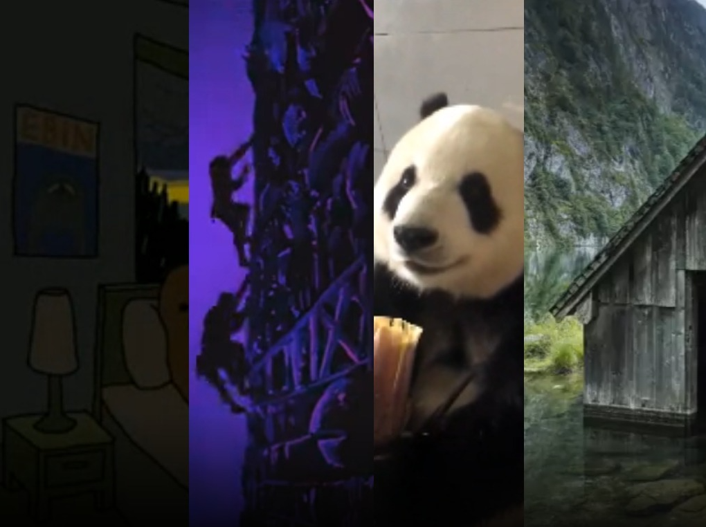

+++
title = "Kaleidoscope"
date = "2022-06-15"
tags = ["project", "complete"]
+++

A website meant to endlessly play little video clips in a random order.

The images are pulled from a publicly accessible bucket in S3,
which are populated by a simple script that scrapes image boards online

This project probably holds the record for the most used thing I have made in my personal time.
It's nice to just set it going on a monitor and have it as background noise.

- [Site Link](http://kaleidoscope.alexlbates.com)
- [Source Code](https://github.com/alloba/kaleidoscope)

